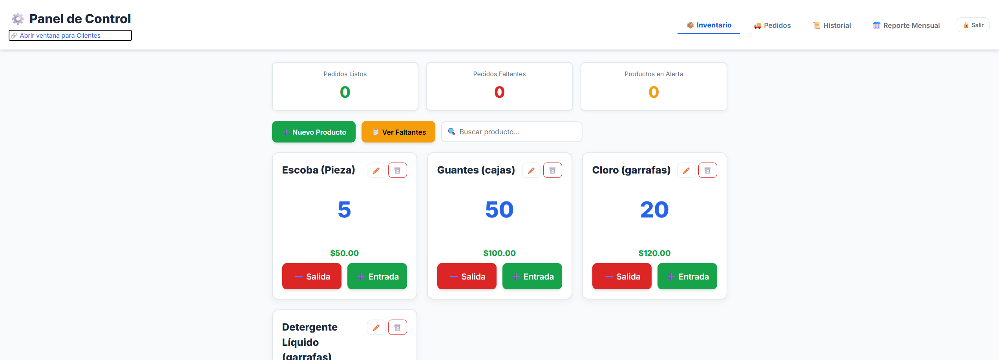
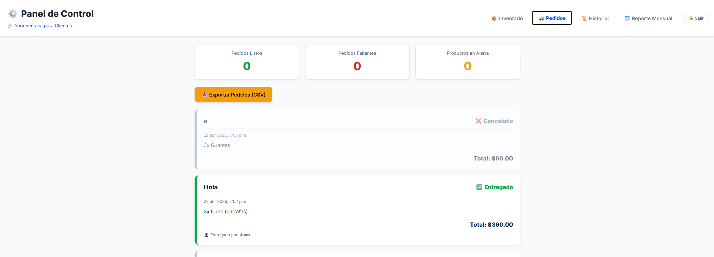
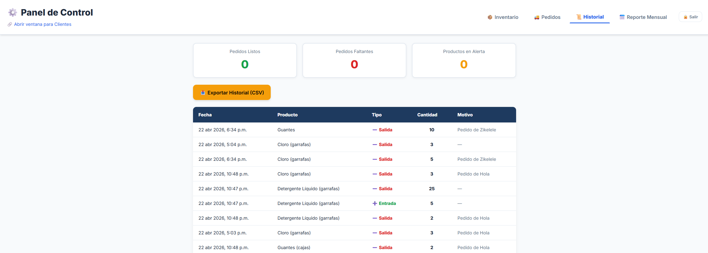
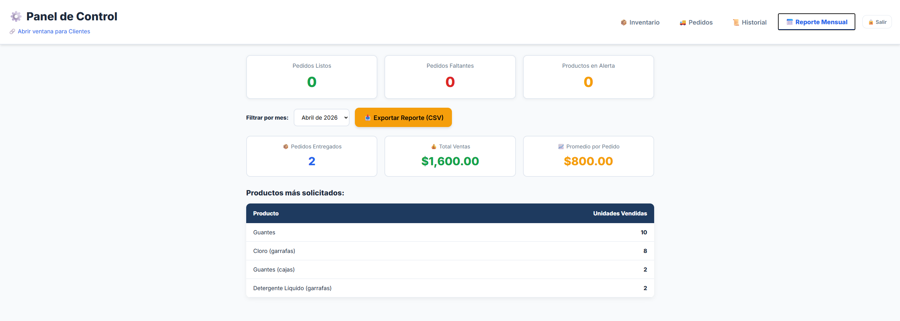
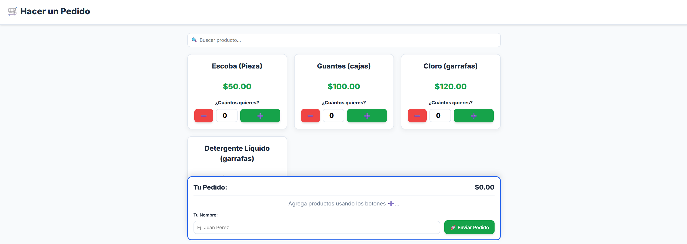

# 🧹 Sistema de Inventario y Pedidos — Productos de Limpieza

Sistema web completo para la gestión de inventario y pedidos de una empresa de productos de limpieza. Diseñado con enfoque en la **accesibilidad para adultos mayores**, sincronización en tiempo real y despliegue en la nube.

---

## 🌐 Demo en Vivo

> 🔗 **Panel Admin:** [https://inslim.netlify.app](https://inslim.netlify.app)
> 🛒 **Vista Cliente:** [https://inslim.netlify.app/cliente.html](https://inslim.netlify.app/cliente.html)

---

## ✨ Funcionalidades

### 👨‍💼 Panel de Administración
- 🔐 **Autenticación por contraseña** con sesión protegida
- 📦 **Gestión de inventario**: agregar, editar y eliminar productos
- 🔍 **Búsqueda en tiempo real** con normalización de acentos
- ⚠️ **Alertas automáticas** cuando el stock baja del mínimo configurado
- 📊 **Dashboard** con resumen de pedidos listos, faltantes y productos en alerta
- 🔔 **Notificaciones instantáneas** (toast) al recibir un nuevo pedido
- 📅 **Reporte mensual**: ventas totales, promedio por pedido y productos más solicitados
- 📥 **Exportación a CSV** de pedidos, historial y reportes mensuales
- 🖨️ **Reporte de faltantes** imprimible
- 📜 **Historial completo** de entradas y salidas de inventario
- 👤 **Registro del entregador** al completar cada pedido

### 🛒 Vista del Cliente
- Catálogo de productos con precios visibles
- Carrito de compras con resumen de pedido
- Envío de pedidos con nombre del cliente
- Interfaz simplificada y accesible

---

## 🛠️ Stack Tecnológico

| Tecnología | Uso |
|---|---|
| **HTML5 / CSS3** | Estructura y estilos (sin frameworks CSS) |
| **JavaScript (Vanilla)** | Lógica del cliente |
| **Firebase Firestore** | Base de datos en tiempo real (NoSQL) |
| **Firebase SDK (compat v10)** | Conexión al backend |
| **Netlify** | Despliegue y hosting |
| **Google Fonts (Inter)** | Tipografía moderna |

---

## 🗂️ Estructura del Proyecto

```
sistema-inventario-limpieza/
├── index.html       # Panel de administración
├── cliente.html     # Vista del cliente para hacer pedidos
├── admin.js         # Lógica del panel admin (700+ líneas)
├── cliente.js       # Lógica de la vista cliente
├── shared.js        # Conexión a Firebase y funciones compartidas
├── app.js           # Inicialización y utilidades globales
└── styles.css       # Estilos (diseño dark mode + responsive)
```

---

## 🚀 Arquitectura

```
Cliente (Netlify)           Firebase (Nube)
┌──────────────────┐       ┌───────────────────┐
│  index.html      │◄─────►│  inventario       │
│  (Admin Panel)   │       │  pedidos          │
│                  │       │  historial        │
│  cliente.html    │◄─────►│                   │
│  (Vista Cliente) │       │  (Firestore DB)   │
└──────────────────┘       └───────────────────┘
         │
    onSnapshot()
    (Tiempo Real)
```

Los datos se sincronizan automáticamente en **tiempo real** usando `onSnapshot` de Firestore: cuando un cliente hace un pedido, el administrador lo ve al instante sin necesidad de recargar la página.

---

## 📸 Capturas de Pantalla

### 🔐 Login


### 📦 Inventario


### 🚚 Pedidos


### 📜 Historial de Movimientos


### 📅 Reporte Mensual


### 🛒 Vista del Cliente — Hacer Pedido


---

## ⚙️ Instalación y Uso Local

### Prerrequisitos
- Una cuenta en [Firebase](https://firebase.google.com/) con un proyecto Firestore activo
- Un servidor local (p. ej. la extensión **Live Server** de VS Code)

### Pasos

1. **Clona el repositorio:**
   ```bash
   git clone https://github.com/tu-usuario/sistema-inventario-limpieza.git
   cd sistema-inventario-limpieza
   ```

2. **Configura Firebase:**
   Abre `shared.js` y reemplaza el objeto `firebaseConfig` con los datos de tu proyecto Firebase:
   ```js
   const firebaseConfig = {
     apiKey: "TU_API_KEY",
     authDomain: "tu-proyecto.firebaseapp.com",
     projectId: "tu-proyecto-id",
     // ...
   };
   ```

3. **Abre con Live Server** o cualquier servidor local apuntando a `index.html`.

### Despliegue en Netlify
1. Sube el repositorio a GitHub
2. Conecta el repositorio en [netlify.com](https://netlify.com)
3. Configura el directorio de publicación como la raíz (`/`)
4. ¡Listo! 🎉

---

## 🔒 Seguridad

- La contraseña del administrador se valida en el cliente y la sesión se guarda en `sessionStorage` (se borra al cerrar el navegador).
- Las **Reglas de Firestore** deben configurarse en la consola de Firebase para controlar el acceso en producción.

---

## 🧑‍💻 Desarrollado con

- Diseño accesible pensado para **usuarios no técnicos y adultos mayores**
- Letras grandes, botones claros y flujo de uso simplificado
- Tema oscuro (*dark mode*) con colores de alto contraste

---

## 📄 Licencia

Este proyecto es de uso personal/portafolio. Siéntete libre de usarlo como referencia o inspiración.
